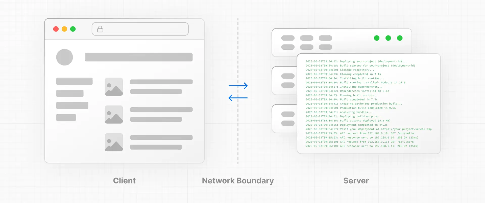

# Komponen Server dan Client

## Environments

Terdapat dua environment suatu komponen bisa dirender: di client dan di server. Client merujuk pada browser user yang mengunjungi situs Next JS. Sementara server merujuk pada komputer yang menjalankan framework Next JS kita.

Kedua environment ini memiliki perbedaan dalam fungsionalitas.

Komponen yang dirender di server bisa

- mengakses dependencies backend (seperti Prisma, TypeORM, Node API) secara langsung;
- dan mengakses informasi rahasia (seperti API key, dan access tokens).

Sementara komponen yang dirender di cient bisa

- menambahkan interaktivitas dan event listeners (seperti `onClick`);
- menggunakan state dan lifecycle effects (seperti `useState`, `useReducer`, `useEffect`);
- dan menggunakan API yang hanya ada di browser (seperti objek `window`).

## Server component

Komponen server dirender di environment server. Next JS menggunakan server component secara default.

## Client component

Komponen server bisa di pre-render dan dijalankan (melalui SSR) di server, dan dihidrasi di client. Jadi perlu diingat, client component itu akan dijalankan di server untuk pre-rendering (SSR), dan di client untuk rendering.

## Penggunaan

Gunakan server component jika Anda ingin

- menge-fetch data;
- mengakses informasi rahasia di server;
- mengakses dependencies backend (seperti Prisma, TypeORM, Node API) secara langsung;
- dan menyimpan dependencies berukuran besar di server agar tidak dijalankan di client untuk meringankan ukuran javascript yang dikirim ke client.

Gunakan client component jika Anda ingin

- menambahkan interaktivitas dan event listeners (seperti `onClick`);
- menggunakan state dan lifecycle effects (seperti `useState`, `useReducer`, `useEffect`);
- dan menggunakan API yang hanya ada di browser (seperti objek `window` dan Geolocation API).

# Perbedaan App Router dengan Page Router

Next.js memiliki dua pendekatan utama dalam mengelola routing aplikasi: **App Router** dan **Page Router**. Kedua sistem ini memiliki tujuan dan karakteristik yang berbeda. Berikut adalah penjelasan lengkapnya.

## 1. Page Router (Dirilis Sebelum Next.js 13)

- **Struktur Folder**: `pages/`
- **Routing Berdasarkan Folder**: Semua file di dalam folder `pages/` otomatis menjadi rute berdasarkan struktur filenya. Misalnya, file `pages/about.js` akan diakses melalui URL `/about`.
- **Server-Side Rendering (SSR) dan Static Generation**:
  - Mendukung server-side rendering melalui `getServerSideProps`.
  - Mendukung static generation melalui `getStaticProps` dan `getStaticPaths`.
- **Custom API Routes**: API routes juga dibuat di dalam folder `pages/api`, misalnya `pages/api/hello.js` akan diakses di `/api/hello`.
- **Penggunaan Hooks**: Mendukung hooks React seperti `useEffect`, tetapi tidak mendukung fitur server components.

## 2. App Router (Dirilis di Next.js 13)

- **Struktur Folder**: `app/`
- **Server Components dan Client Components**:
  - Di App Router, komponen dapat diklasifikasikan sebagai **Server Component** atau **Client Component**.
  - Defaultnya, semua komponen di dalam `app/` adalah **Server Component**. Jika komponen perlu dijalankan di klien, kita harus menggunakan `"use client";` di bagian atas file tersebut.
- **File-Based Routing yang Lebih Kompleks**:
  - Menggunakan file `layout.js`, `page.js`, dan `error.js` untuk mengatur struktur halaman.
  - Halaman utama biasanya berada di `app/page.js`, sedangkan sub-rute bisa ditambahkan di dalam folder dengan nama yang sesuai, misalnya `app/about/page.js` untuk `/about`.
- **Pengaturan Layout**:
  - Menggunakan file `layout.js` untuk membuat layout yang persist (tetap ada) di seluruh halaman, seperti header atau footer.
  - Layouts dapat di-nest (bersarang), memungkinkan struktur yang lebih kompleks.
- **Data Fetching**:
  - Menggunakan fungsi async secara langsung dalam komponen untuk pengambilan data.
  - Dukungan penuh untuk `Suspense` dan streaming data, yang memberikan pengalaman loading yang lebih cepat dan interaktif.
- **Dynamic Segments**:
  - Mendukung **dynamic segments** untuk rute dinamis dengan struktur folder seperti `[id]`.
- **API Routes**: Mendukung API routes, tetapi tidak perlu terikat pada folder `pages/api` seperti pada Page Router.

## Tabel Perbedaan Singkat

| Fitur                   | Page Router             | App Router               |
|-------------------------|-------------------------|--------------------------|
| Struktur Folder         | `pages/`                | `app/`                   |
| Default Component       | Client Components       | Server Components        |
| Data Fetching           | `getStaticProps`, `getServerSideProps` | Fetching langsung di komponen |
| Dukungan API Routes     | `pages/api/`            | Di dalam `app/`          |
| Layout Management       | Tidak fleksibel         | Menggunakan `layout.js`  |
| Routing Dinamis         | `pages/[id].js`         | `app/[id]/page.js`       |

## Kapan Menggunakan Page Router atau App Router?

- **Page Router**: Cocok jika masih menggunakan versi Next.js sebelum 13 atau aplikasi yang tidak memerlukan fitur-fitur baru seperti streaming dan nested layouts.
- **App Router**: Disarankan untuk aplikasi yang menggunakan Next.js 13 atau lebih tinggi, terutama jika ingin memanfaatkan keunggulan Server Components dan fitur data fetching yang lebih fleksibel.

# Pembuatan Routes dalam App Router

Isi di sini.

# Layout

Isi di sini.